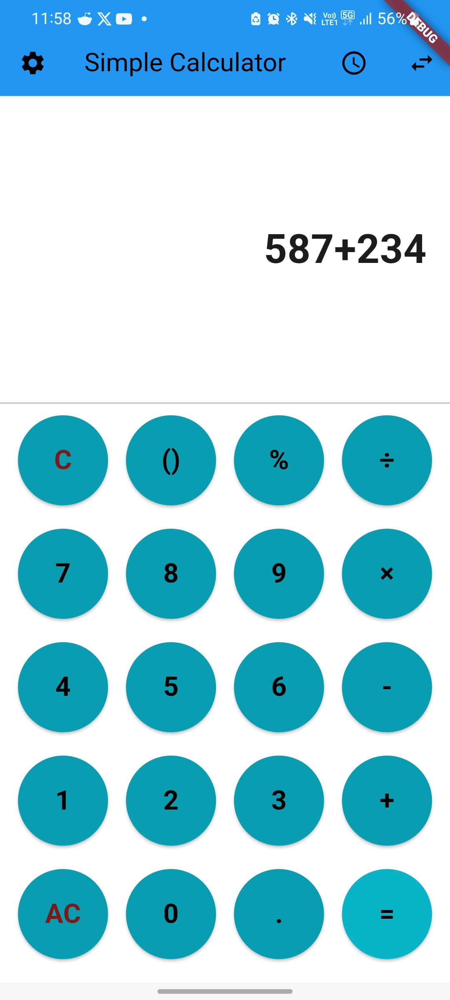
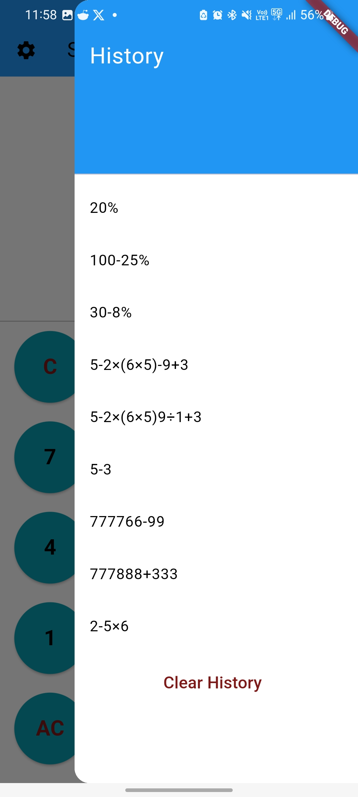
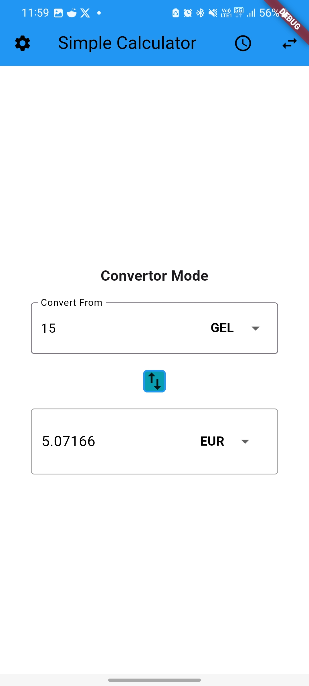

# Calculator Project
This is a Flutter simple calculator that not only performs arithmetic expressions but also includes features such as history tracker for past operations and a currency conversion functionality.
Current implementation is optimized for Android and Web applications.

# Features
Features supported by the application include:

1. Basic Arithmetic Operations:
   - Addition, substraction, multiplication, division and percentages
   - Allows both integers and decimal point numbers
   - Assist on writing regarding parenthesis.
2. Expression History:
   - Keep track of your expressions and operations
   - Clicking on any of the history items automatically fills it into the current calculation result, allowing users o reuse and extend previous calculations
3. Currency Conversion:
   - Allows conversion amongst different currencies.
   - Real-time currency exchange rates fetched via external API from fixer.io.
   - Perform conversions "on the fly" by selecting the FROM and TO currency.

# Usage

1. Calculator
   - Use the '=' button to store expression in history and receive result
   - Use the 'C' button to delete last inserted character.
   - Use the 'AC' button to delete current expression.
   - Calculator assit on parenthesis usage on current expression. If a set is not closed it is atuomatically calculated.
2. Currency Conversion:
   - Switch currencies via the searchable DropDown.
   - Enter amount on first Box and view Converted amount on the second.
   - The Converted amount is displayed automatically.

# Installation

1. Close Repository
   - 'git clone https://github.com/iasonasdi/calculator.git'
2. Navigate to Project Directory:
   - 'cd calculator'
3. Install Dependencies:
   - 'flutter pub get'
4. Run Application:
   - 'flutter run'

# Branches

Three branches are publically available:
1. Main Branch
   - Related to the application's code and implementation in a stable state.
2. Dev Branch
   - Related to the application's code currently under development to improve or implement further futures.
3. Deploy Branch
   - Used as a deploy reference for codemagic.io

# Images

The application offer two themes: Light and Dark.

1. Light Theme
   - Calculator Screen
    
   - History Screen
    
   - Conversion Screen
    

2. Dark Theme
   - Calculator Screen
   
   - History Screen
   
   - Conversion Screen
   